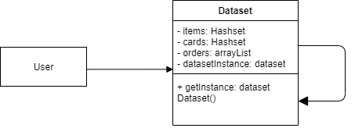
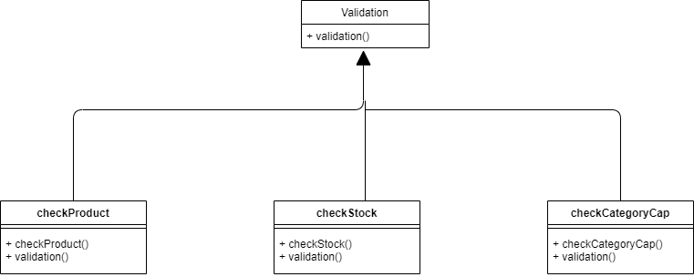
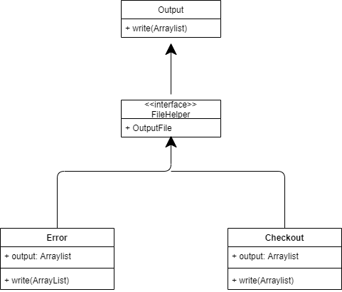

# Individual-Project-Sahil Bhagchandani

## Design Pattern

Three Main Design Patterns were used for this Individual Project

### 1 - Singleton

- It's a creational design pattern that lets you to assure that a class only has one instance while yet offering global access to that instance.
- Used this pattern to store the data for the entire application. Class implemented using singleton pattern is Database.java.

### 2 - Chain of Responsibility

- It's a behavioral design pattern that lets you pass requests along a chain of handlers. Upon receiving a request, each handler decides either to process the request or to pass it to the next handler in the chain.
- This design pattern is used to handle the every required validation of each requested item

### 3 - Factory

- Factory Method is a creational design pattern that provides an interface for creating objects in a superclass, but allows subclasses to alter the type of objects that will be created.
- Used this pattern by creating an interface "FileHelper" which is implemented by "Error" and "Checkout". The Output File is created by using "Output"

## Commands to run Project
 
 - Open Command Prompt in src file
 - Run `javac Main.Java` in command Prompt. Example :  `C:\Users\Sahil\Downloads\IndividualProject202\IndividualProject202\src> javac Main.java`
 - Run `java Main "<FilePath_to_Dataset>" "<FilePath_to_Cards>" "<FilePath_to_InputFile>"` in command prompt. 
   Example :  `C:\Users\Sahil\Downloads\IndividualProject202\IndividualProject202\src> java Main "C:\Users\Sahil\Downloads\IndividualProject202\IndividualProject202\files\Dataset - Sheet1.csv" "C:\Users\Sahil\Downloads\IndividualProject202\IndividualProject202\files\Cards - Sheet1.csv" "C:\Users\Sahil\Downloads\IndividualProject202\IndividualProject202\files\Input1 - Sheet1.csv"`

## Output

### Input 1

### Input 2

### Input 3

